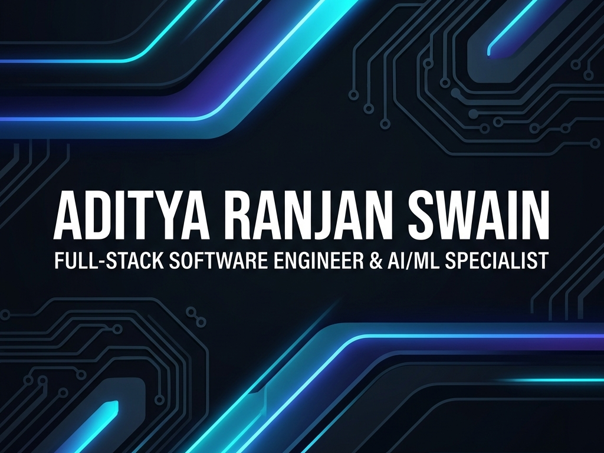

<div align="center">

  <p align="center">
    
  </p>

  <br/>

  <!-- Dynamic Typing Animation -->
  <a href="https://github.com/Aditya1791">
    
  </a>

  <br/><br/>

  [](https://linkedin.com/in/aditya-ranjan-swain)
  [](https://github.com/Aditya1791)
  [](mailto:swainaditya85@gmail.com)
  [](https://maps.google.com/?q=Bhubaneswar,India)

  <br/><br/>

  > 💡 *Merging robust full-stack architecture (MERN & Python/Flask) with cutting-edge Deep Learning & Computer Vision to craft intelligent, real-time, production-grade applications.*

</div>

---

## 🌟 Executive Summary

**B.Tech Computer Science & Engineering** graduate from **Trident Academy of Technology** (Graduated May 2026) and alumnus of **Sainik School Bhubaneswar**. 

With **2 months of hands-on AI/ML internship experience** across **CTTC MSME** and **1stop.ai**, alongside end-to-end full-stack software development skills, I bridge the gap between intelligent deep learning models and scalable web platforms.

- 🚀 **Full-Stack Proficiency**: React.js, Node.js, Express.js, Flask, MongoDB, MySQL, WebSockets, Socket.io, Docker.
- 🧠 **AI/ML & Computer Vision**: TensorFlow, Keras, OpenCV, DeepFace, Dlib, Scikit-learn, NLP, CNN architectures.
- 📦 **Proven Track Record**: Architected and shipped 3 production-grade full-stack applications & deployed operational AI systems.

---

## 💼 Internship Experience

### 🔬 **AI/ML Engineer Intern** | *CTTC MSME, Bhubaneswar*
`Jul 2025 – Aug 2025`
- **Real-Time Attendance System**: Engineered an operational face recognition attendance system using **CNNs, TensorFlow, Keras, and OpenCV**, directly integrated with a **MySQL** database for live automated logging.
- **Custom Object Detection**: Built object detection pipelines using transfer learning and custom data augmentation techniques (rotations, brightness shifts, flipping) to maximize model generalization.
- **Production Integration**: Collaborated in a 4-member cross-functional team to embed deep learning models into desktop client software for live operational workflows.

### 🤖 **AI/ML Engineer Intern** | *1stop.ai (Remote)*
`Jul 2025 – Sep 2025`
- **NLP Text Classification**: Designed a multi-class NLP pipeline featuring tokenization, TF-IDF vectorization, word embeddings, and deep neural network classifiers.
- **Landmark & Image Recognition**: Developed end-to-end CNN image classification models in TensorFlow/Keras from raw data ingestion to evaluation (Precision, Recall, F1-Score).
- **ML Pipeline Optimization**: Implemented regularization strategies (Dropout, Batch Normalization, Early Stopping) to minimize train-validation variance.

---

## 🛠️ Tech Stack & Skillset

<div align="center">

### 💻 Languages & Fundamentals


### 🎨 Frontend Development


### ⚙️ Backend & Infrastructure


### 🧠 AI / Machine Learning / Computer Vision


### 🗄️ Databases & Cloud Services


</div>

---

## 🚀 Key Projects

### 🛡️ **1. Smart AI-Based Proctoring System**
> **Tech Stack**: `Python` · `Flask` · `MySQL` · `DeepFace` · `OpenCV` · `Dlib` · `Bootstrap` · `Stripe` · `Docker`

- **Biometric Authentication**: Prevents impersonation at login using **DeepFace** real-time facial verification against registered student profiles.
- **Live AI Proctoring Engine**: Built with **OpenCV & Dlib's 68-point facial landmark model** to continuously track gaze direction, multi-face presence, and absences with timestamped anomaly logs.
- **Multi-Format Exam & Built-in Compiler**: Supports MCQs (with CSV upload & negative marking), subjective tests, and an **in-browser coding compiler supporting 15+ languages** (C, C++, Java, Python, Node.js).
- **Monetization & Deployment**: Integrated **Stripe API** for professor credit top-ups; fully **Dockerized** with MySQL database and Flask-Session management.

---

### 📊 **2. Real-Time Collaborative Enterprise Project Management Workspace**
> **Tech Stack**: `React.js` · `Node.js` · `Express.js` · `MongoDB` · `Socket.io` · `Redux Toolkit` · `JWT`

- **Instant Board Synchronization**: Trello-style drag-and-drop Kanban boards powered by `@hello-pangea/dnd` and **Socket.io** WebSocket broadcasting for instant multi-user board updates without refreshing.
- **Optimistic UI Updates**: Instant client-side state mutation with seamless UI rollback on API network failure.
- **Workspace Security & Audit Trail**: Granular RBAC permissions with JWT middleware and background activity trail logging stored in MongoDB.

---

### 🎓 **3. Advanced Remote Examination & Assessment Portal**
> **Tech Stack**: `React.js` · `Redux Toolkit` · `Node.js` · `Express.js` · `MongoDB` · `Chart.js` · `JWT`

- **Triple Portal Architecture**: Dedicated, security-scoped portals for Admin, Teacher, and Student roles with Express middleware protection.
- **Rich Assessment Creator**: Dynamic question banks, automated evaluation logic, and custom exam timers built with React rich-text editing.
- **Analytics & Anti-Cheat**: Real-time detection of browser blur events, tab switches, and window focus changes paired with **Chart.js** analytics dashboards for class metrics.

---

### 📷 **4. Operational Facial Recognition Attendance System**
> **Tech Stack**: `Python` · `OpenCV` · `CNN` · `TensorFlow` · `Keras` · `MySQL`

- **End-to-End Pipeline**: Live video feed ingestion $\rightarrow$ Haar Cascade face detection $\rightarrow$ CNN feature verification $\rightarrow$ Automated MySQL database attendance logging with timestamps.
- **Production-Adopted**: Developed during internship at **CTTC MSME** and deployed for actual operational use.

---

### 📄 **5. NLP Multi-Class Text Classification Pipeline**
> **Tech Stack**: `Python` · `TensorFlow` · `Keras` · `Scikit-Learn` · `Kaggle`

- Full NLP pipeline handling text cleaning, tokenization, stop-word removal, TF-IDF vectorization, word embeddings, and deep neural network training evaluated with F1-Score & AUC-ROC metrics.

---

## 🎓 Education & Background

| Degree / Course | Institution | Details / Metrics | Year |
| :--- | :--- | :--- | :--- |
| **B.Tech in Computer Science & Engineering** | Trident Academy of Technology, Bhubaneswar | CGPA: **6.8 / 10** | 2022 – 2026 |
| **Class XII (CBSE)** | Sainik School Bhubaneswar | Physics, Chemistry, Mathematics, Computer Science | 2020 – 2022 |
| **Class X (CBSE)** | Sainik School Bhubaneswar | Mathematics, Computer Science, Science(P.C.B.) | 2018 – 2020 |

---

## 🏆 Certifications & Training

- 🏅 **AI/ML Training Program**: CTTC MSME, Bhubaneswar (2025)
- 🏅 **AI/ML Internship Certification**: 1stop.ai (2025)
- 🏅 **Full-Stack Web Development (MERN Stack)**: Self-Directed / GitHub Portfolio (2024 – 2025)

---

## ⚡ Current Status & Focus

```python
aditya_profile = {
    "current_status": "B.Tech CSE Graduate (Completed May 2026)",
    "seeking_roles": [
        "Full-Stack Developer", 
        "AI/ML Engineer", 
        "Front-End Developer", 
        "Software Engineer"
    ],
    "currently_building": [
        "Intelligent MERN Applications", 
        "Edge ML Computer Vision Models"
    ],
    "key_strengths": [
        "End-to-end Web Architecture (MERN & Flask)",
        "Biometric & Computer Vision Systems (OpenCV, DeepFace, TensorFlow)",
        "Real-Time WebSockets & Optimistic UI Updates",
        "Containerization (Docker) & Clean Production Code"
    ]
}
```

---

## 📊 GitHub Analytics & Metrics

<div align="center">
  
  
</div>

<br/>

<div align="center">
  
</div>

---

<div align="center">

### 🤝 Let's Connect & Collaborate!

[](mailto:swainaditya85@gmail.com)
[](https://linkedin.com/in/aditya-ranjan-swain)
[](https://github.com/Aditya1791)
[](https://x.com/Monkey_D_Adi)

*"Building robust, intelligent systems that connect seamless user interfaces with deep learning models."*

</div>
